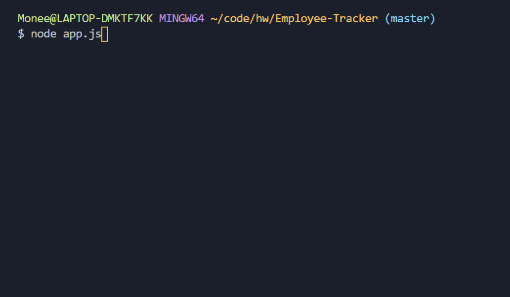

# Employee-Tracker

## Description
An application for managing a company's employees using node, inquirer, and MySQL.

## Table of Contents
* [Installation](#installation)
* [Technologies-Libraries](#technologies-libraries)
* [Demo](#demo)
* [Credits](#credits)

## Installation
In your terminal type:
```git clone https://github.com/verlitas/Employee-Tracker.git```
* Open in Visual Studio to build and run.
* For further instructions, visit https://help.github.com.

## Technologies-Libraries
JavaScript - Node - Inquirer - MySQL

## Demo


## Credits
[Melody Kirshberg](https://github.com/verlitas)  
[UABootCamp](https://bootcamp.ce.arizona.edu/coding/)
